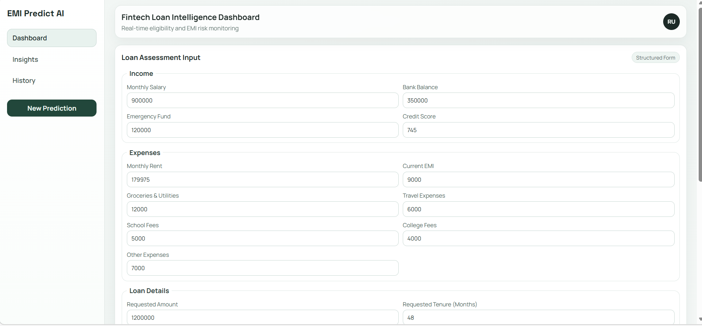
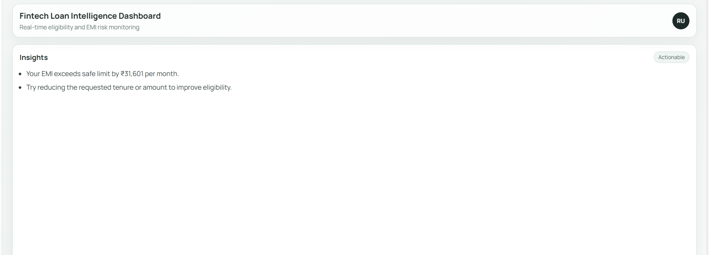

# EMI Predict AI — Full-Stack Financial Risk Assessment System

A production-style fintech application that predicts loan EMIs, evaluates
financial eligibility, and classifies risk in real time using machine learning.
Built with a React frontend, FastAPI backend, and a trained regression model —
integrated end-to-end as a working full-stack system.

---

## Why This Project Matters

Managing loan affordability is a real-world challenge for millions of borrowers.
EMI Predict AI addresses this by combining financial logic with machine learning
to give users instant, data-driven insights into whether a loan is truly
affordable — not just approved.


##  Screenshots

### Dashboard


### Prediction Form


### Insights



## Key Features

- Real-time EMI prediction powered by a trained regression model
- Financial risk classification: Safe / Borderline / High Risk
- Affordable vs Required EMI comparison with visual breakdown
- KPI dashboard with actionable financial insights
- Structured multi-field input form with validation
- Prediction history tracking across sessions
- Modular, scalable backend architecture


##  System Architecture

Frontend (React)
    ↓
API Layer (Axios)
    ↓
Backend (FastAPI)
    ↓
Service Layer (Business Logic)
    ↓
ML Model (Scikit-learn + StandardScaler)
    ↓
JSON Response → Dashboard UI

The frontend communicates with the FastAPI backend via REST APIs.
The backend processes user input, applies preprocessing and model inference,
computes risk metrics, and returns structured results for visualization.


## Tech Stack

Frontend:
  - React (Vite) — fast, component-based UI
  - CSS Modules — scoped, maintainable styling
  - Axios — HTTP client for API communication

Backend:
  - FastAPI — high-performance Python API framework
  - Pydantic — request validation and schema enforcement
  - Modular architecture — routes, services, and schemas separated by concern

Machine Learning:
  - Scikit-learn — model training and preprocessing
  - Regression Model — EMI prediction from financial inputs
  - StandardScaler — feature normalization for consistent predictions


## Risk Classification Logic

  Affordability Ratio = Required EMI / Affordable EMI

  Safe        ->  Ratio is within comfortable limits
  Borderline  ->  Ratio is approaching the threshold
  High Risk   ->  Ratio exceeds affordable capacity

This ratio is computed on the backend and returned alongside
the predicted EMI for display on the dashboard.


## API Reference

  POST /finance/predict

  Accepts a JSON body with user financial details.
  Returns predicted EMI, affordability ratio, and risk category.
## Sample Request

```json
{
  "income": 50000,
  "expenses": 20000,
  "loan_amount": 300000,
  "tenure": 36
}

{
  "emi": 12500,
  "affordability_ratio": 0.8,
  "risk_level": "Safe"
}


## Setup and Installation

Prerequisites: Python 3.9+, Node.js 18+

Backend:
  cd backend
  pip install -r requirements.txt
  uvicorn backend.main:app --reload

Frontend:
  cd frontend
  npm install
  npm run dev

  App runs at: http://localhost:5173
  API runs at: http://localhost:8000


##  Planned Improvements

- Interactive charts using Recharts
- Explainable AI — reasoning behind each risk classification
- Data persistence with a database layer
- Cloud deployment (Render / Vercel)


## Author

Rudra Naresh

