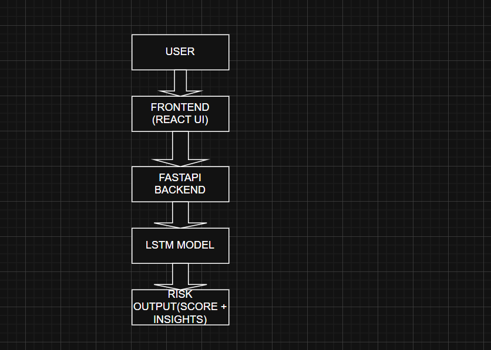
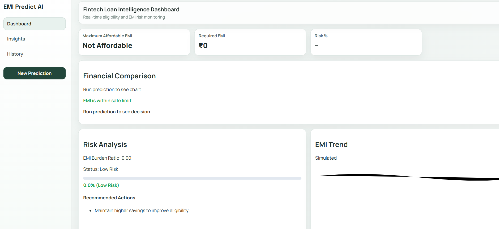
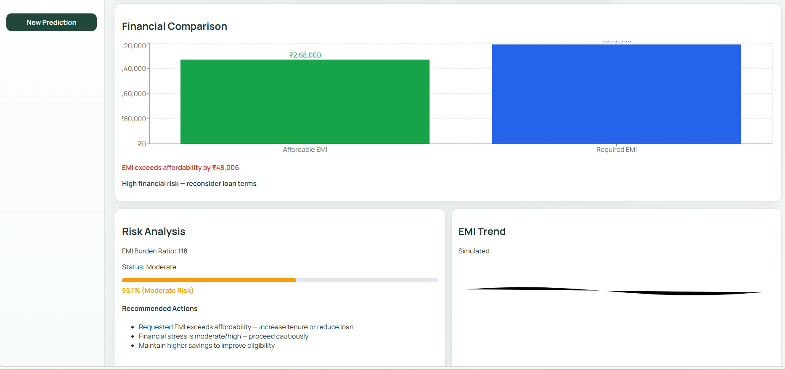
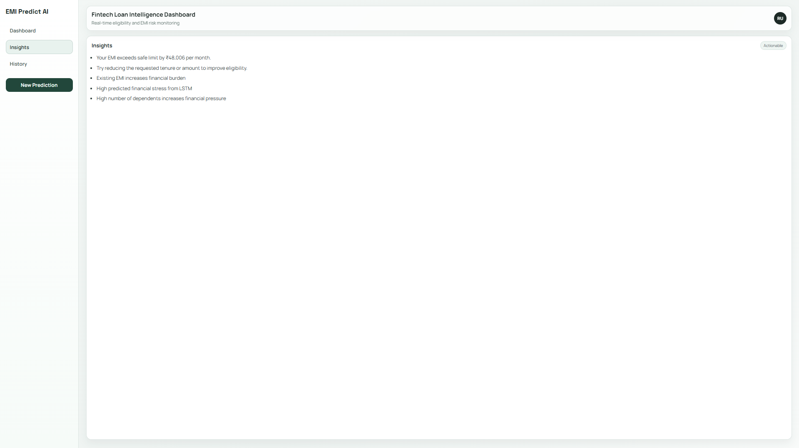

#  Fintech Loan Risk Intelligence System

An end-to-end AI-powered fintech application that predicts loan eligibility, EMI affordability, and financial risk using an LSTM-based model with an interactive dashboard.

---

##  Features

- Loan Eligibility Prediction  
- EMI Calculation & Affordability Analysis  
- LSTM-Based Risk Scoring  
- Financial Comparison Dashboard  
- Explainable AI (XAI) Insights  
- Recommendation Engine (Actionable Suggestions)  
- Prediction History Tracking  

---

##  System Overview

### 🔹 Backend (FastAPI)
- Handles prediction logic  
- LSTM inference for financial risk  
- Rule-based explainability  
- EMI calculation engine  

### 🔹 Frontend (React + Vite)
- Interactive dashboard UI  
- Real-time prediction visualization  
- Risk meter & financial charts  
- Insights and recommendations display  

### 🔹 ML Model
- LSTM processes 6-month financial sequences  

**Features:**
- Income  
- Expenses  
- Debt-to-Income Ratio  
- EMI presence  

**Outputs:**
- Risk score (0–1)  
- Financial stress prediction  

---

##  Key Concepts

- **Debt-to-Income Ratio (DTI):** Financial burden indicator  
- **Risk Score:** Probability of financial stress  
- **Affordable EMI:** Based on 40% income threshold  
- **Explainability:** Rule-based + model-based reasoning  

---

##  Sample Output

- **Eligibility:** Not Eligible  
- **Risk Score:** ~55% (Moderate Risk)  

**Insights:**
- Existing EMI increases financial burden  
- Requested EMI exceeds affordability  

---

##  Screenshots

###  System Architecture

###  Dashboard

###  Prediction Output

###  Risk Analysis

---

##  Installation

### 1. Clone Repository

### 2. Backend Setup
cd backend
pip install -r requirements.txt
uvicorn main:app --reload

### 3. Frontend Setup
cd frontend
npm install
npm run dev

---

## API endpoint
 Real financial dataset integration  
- Advanced explainability (SHAP/LIME)  
- Improved LSTM training  
- What-if simulation sliders  
