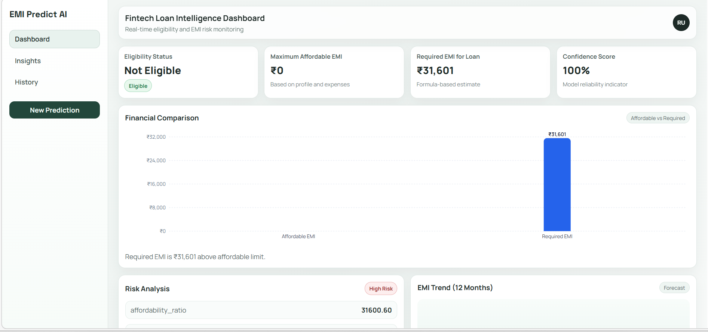

FINTECH LOAN RISK INTELLIGENCE SYSTEM

An end-to-end AI-powered fintech application that predicts loan eligibility, EMI affordability, and financial risk using an LSTM-based model with an interactive dashboard.

FEATURES

Loan Eligibility Prediction
EMI Calculation & Affordability Analysis
LSTM-Based Risk Scoring
Financial Comparison Dashboard
Explainable AI (XAI) Insights
Recommendation Engine (Actionable Suggestions)
Prediction History Tracking

SYSTEM OVERVIEW

BACKEND (FastAPI)
- Handles prediction logic  
- LSTM inference for financial risk  
- Rule-based explainability  
- EMI calculation engine  

FRONTEND (React + Vite)
- Interactive dashboard UI  
- Real-time prediction visualization  
- Risk meter & financial charts  
- Insights and recommendations display  

ML MODEL
- LSTM processes 6-month financial sequences  
- Features:
  - Income  
  - Expenses  
  - Debt-to-Income Ratio  
  - EMI presence  
- Outputs:
  - Risk score (0–1)  
  - Financial stress prediction  

KEY CONCEPTS

Debt-to-Income Ratio (DTI): Financial burden indicator
Risk Score: Probability of financial stress
Affordable EMI: Based on 40% income threshold
Explainability: Rule-based + model-based reasoning

SAMPLE OUTPUT

Eligibility: Not Eligible
Risk Score: ~55% (Moderate Risk)
Insights:
Existing EMI increases financial burden
Requested EMI exceeds affordability

SCREENSHOTS

SCREENSHOTS

##  System Architecture

##  Dashboard

##  Prediction Output

##  Risk Analysis

git clone https://github.com/your-username/fintech-loan-risk-ai.git

cd fintech-loan-risk-ai

Backend Setup

cd backend
pip install -r requirements.txt
uvicorn main:app --reload

Frontend Setup

cd frontend
npm install
npm run dev

API ENDPOINT

POST /predict

FUTURE IMPROVEMENTS

Real financial dataset integration
Advanced explainability (SHAP/LIME)
Improved LSTM training
What-if simulation sliders

